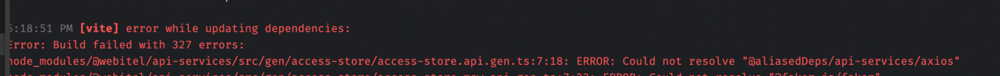
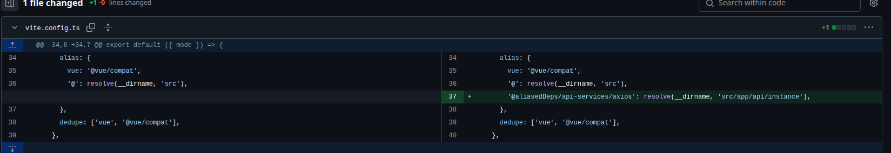

# Introduction and Usage

_author: @dlohvinov_

## Introduction
`// TODO`

## Usage differences & Migration from `webitel-sdk`

### Prerequisites

#### alias

Коли вперше підключаєте `@webitel/api-services`, вам потрібно налаштувати `alias` для його `axios` імпорту.

**Error:**


**Fix:**



### Imports

> [!IMPORTANT]
> Lib exports generated files as `/gen`, and generated models(types, enums) as `/gen/models`.
> **DO NOT** try to export from root (`@webitel/api-services`), or using paths to separate services files.

#### api services
```ts
import {
  getSources, // service
  createSourceBody, // validation
  listSourcesQueryParams, // validation
  updateSourceBody, // validation
} from '@webitel/api-services/gen';
```

#### models

```ts
import { CaseSources } from '@webitel/api-services/gen/models';

/*
interface CasesSource {
    createdAt?: string;
    createdBy?: GeneralLookup;
    description?: string;
    id?: string;
    name?: string;
    type?: CasesSourceType;
    updatedAt?: string;
    updatedBy?: GeneralLookup;
}
 */
```

### Створення сервісу

```ts
const sourceService = new CaseSourcesApiFactor(instance, '', openAPIConfig);  // [!code --]

const sourceService = getSources();  // [!code ++]
```

І все. axios instance підтягнеться самостійно з [alias](#alias)'а.

**Використання створенного сервіса – ідентичне.**

### Використання

#### Динамічні `fieldsToSend` для `sanitizer` трансформера

Зважаючи на те, що ми генеруємо [zod](https://zod.dev/) валідації, то ми можемо з zod-обʼєкта витягти його поля динамічно.
Завдяки цьому, `sanitize`'и `fieldsToSend` можна "тягти" з них.

>[!WARNING]
> В розробці. **Варіант НЕ остаточний**. Але пробувати бавитись вже можна 🙂

```ts
import {
  listSourcesQueryParams,
} from '@webitel/api-services/gen';

import { getFieldsToSendFromZodSchema } from '@webitel/api-services/gen/utils';  // [!code highlight]

// ...
const fieldsToSend = getFieldsToSendFromZodSchema(listSourcesQueryParams);  // [!code highlight]

const { page, size, fields, sort, id, q, type } = applyTransform(params, [
    // ...
    sanitize(fieldsToSend),
    // ...
]);
// ...

```

#### Case Conversion: `camelCase` <-> `snake_case`
**Без змін**: поки ручками. Можливо придумаю щось на основі витягування з zod схеми філдів, щоб це
"зашити" десь.

```ts
const {/*...*/} = applyTransform(params, [
    // ...
    camelToSnake(), // [!code highlight]
    // ...
]);
```

#### Defaults

**Без змін**. Працюєм над цим.

```ts

const defaultObject = { items: [], next: false, count: 0 }; // [!code highlight]

const {/*...*/} = applyTransform(params, [
    // ...
    merge(defaultObject), // [!code highlight]
    // ...
]);
 const fieldsToSend = getFieldsToSendFromZodSchema(listSourcesQueryParams);

const { page, size, fields, sort, id, q, type } = applyTransform(params, [
    
    sanitize(fieldsToSend),
    camelToSnake(),
]);
```

#### Робимо запит

Дл `list`  запитів тепер передаємо обʼєкт, а не набір параметрів. 

Це означає, що:
* Порядок параметрів тепер не має значення (але краще притримуватись старого).
* **Назва параметрів має значення!** (так як це тепер поля обʼєкта).
```ts
const response = await sourceService.listSources({ // Увага!! `(param1, param2, ...)` -> `({ param1, param2, ... })`
    // ...  
      page,
      size,
    // ...
    });
```
#### Використовуємо валідації **за призначенням**

**Поки що ні**. Тут все по-старому, але чекаєм на апдейти.

### Використання типів
**Strongly recommended**. Використовуйте, не соромтесь 🙂

[Як імпортувати?](#models)

### Використання `enums`
Імпортувати [так само, як і типи](#models)

> [!TIP]
>  Ключі згенерованих `enums` мають бути в `PascalCase`. Я це налаштовував. Якщо не робить, маякніть.