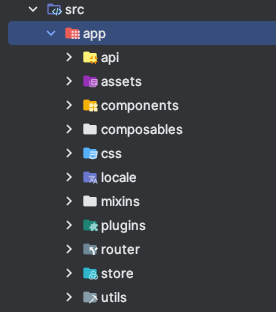
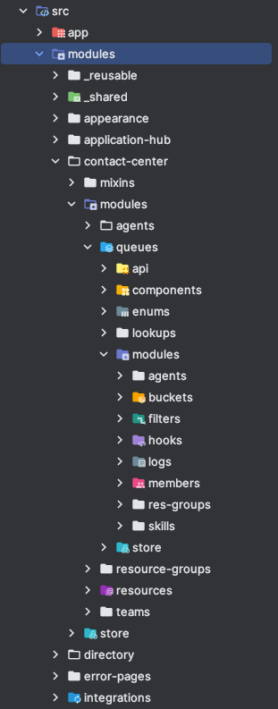

# Applications structure and Intercommunication

Front-end частина Webitel складається з декількох окремих, standalone апплікейшенів,
які (за потреби, що буває доволі рідко) взаємодіють через `redirects`, та `localStorage`.

_Запитаєте: Чому? - Скажу: історично_ 🙂

[Список](#applications-list) апплікашок в кінці доки

## Взаємозвʼязок та взаємодія

Як такого, звʼязку чи взаємодії між різними апплікаціями немає.
Весь спільний, реюзабельний код виноситься у [webitel-ui](#webitel-ui). Перехід між апплікейшенами
відбувається через спільну навігацію, а інформація про користувача завантажується у кожному апплікейшені
окремо.

Втім, авторизація має бути спільною, а також необхідно забезпечити перехід від адмінки до флова, і назад.
Це реалізовано через `route` `redirect` `query params`.

## Паттерни структури самих апплікейшенів

Є певний паттерн, певна логіка, згідно якої розміщаються файлики та папочки у проектах. Основна
ідея в тому, що проекти "нарізаються" на [feature slices](https://feature-sliced.design/).

_Note: Я вперше загуглив це і вперше зайшов на цей сайт, тож, якщо що,
не обіцяю що у нас все структуровано, як в reference model_ 🙂

Як правило, на руті є папки `app` i `modules`.

### Папка `App`

_(на прикладі [адмінки](#admin))_

У папці `app` лежить сетап апплікейшена, один, глобальний, спільний, і все таке: рут компонентик,
підключення глобальних плагінів, роутер, основний стор модуль, або якісь повністю `shared` скрипти,
компоненти, etc.

Як правило, при роботі з проектом, туди додавати нічого не треба, бо там вже все було додано на етапі
сетапу цього проекту 🙂.

### Папка `Modules`

_(на прикладі [адмінки](#admin))_

У папці `modules` лежать модулі-фічі. Залежно від апплікейшена, це можуть бути різні ділення на фічі.
Наприклад, у адмінці це можуть бути одночасно ділення по роутах, і просто модуль зі стором, спільним
для всіх попередніх роутів.

Кожен модуль може містити в собі такі штуки (і відповідно папки), як:
- `api`
- `components`
- `css`
- `store`
- `assets`
- `enums`
- `scripts`
- `mixins`/`composables`
- `modules`

Ну і щось більш екзотичне, залежно від потреби.

### Рекурсивність модулів

Модуль може включати в себе модулі. Рекурсивно, на будь-яку глибину.

_Note: store має бути ієрархічним, тобто, модуль-чайлд має бути так само чайлдом стор-модуля._

## Applications list

### Auth
Невеликий проект, який використовується для авторизації користувачів у всіх інших апплікаціях.
Має власний стор та власні API без задіяння бібліотеки "webitel/ui-sdk".
Використовується Options та Compositions API
- repository: [web-client-auth](https://github.com/webitel/web-client-auth)
- dev: [dev.webitel.com/app/auth](https://dev.webitel.com/app/auth)

### Admin
Найбільший, найтиповіший та найструктурованіший проект, який використовується для адміністрування всіх інших апплікацій.
Він був зроблений першим з усіх та містить багато перевикористанних копонентів. Усі його розділи вписуються у загальну структуру, побудовані на схожих принципах.
Переважна більшість коду написана на перевикористованих міксинах, стор використовується старого зразку [дока](../../../webitel-ui/store/_Introduction/Readme.md).
Відносно недавно було винесено (цей процесс триває і зараз) частину API в бібліотеку "webitel/ui-sdk".
Є маленький відсоток компонентів написаних на Compositions API (та додатково використання composible), але переважна більшість на Options API.

- repository: [client](https://github.com/webitel/client)
- dev: [dev.webitel.com](https://dev.webitel.com/)

### Workspace
Проект використовується для роботи операторів контакт-центру. Містить в собі віджети для роботи з вхідними дзвінками, чатами, та іншими каналами звʼязку.
Використовується Options та Compositions API, стор старого зразку [дока](../../../webitel-ui/store/_Introduction/Readme.md).
Проект використовує різні API, але інформація про поточний подію (це дзвінок/чат/задача) приходять та оновлюються через WebSocket(вся інформація про подію зберігається в сторі як this.task)
- repository: [cc-workslace](https://github.com/webitel/cc-workspaces)
- dev: [dev.webitel.com/workspace](https://dev.webitel.com/workspace)

### Supervisor
Проект використовується для роботи супервайзерів контакт-центру. Містить в собі віджети для роботи з вхідними дзвінками, чатами, та іншими каналами звʼязку.
Використовується Options API, стор старого зразку [дока](../../../webitel-ui/store/_Introduction/Readme.md).
- repository: [cc-supervisor](https://github.com/webitel/cc-supervisor)
- dev: [dev.webitel.com/supervisor](https://dev.webitel.com/supervisor)

### Audit
Проект використовується для аудиту якості роботи операторів контакт-центру.
Перший проект написаний повністтю на Compositions API, стор використовується НОВОГО зразку [дока](../../../webitel-ui/store/_Introduction/Readme.md).
- repository: [cc-quality-auditor](https://github.com/webitel/cc-quality-auditor)
- dev: [dev.webitel.com/audit](https://dev.webitel.com/audit)

### History
Проект використовується для перегляду історії дзвінків контакт-центру.
Використовується Options API, стор старого зразку [дока](../../../webitel-ui/store/_Introduction/Readme.md).
- repository: [cc-history](https://github.com/webitel/cc-history)
- dev: [dev.webitel.com/history](https://dev.webitel.com/history)

### CRM
Проект використовується для роботи з контактами в системі.
Зараз є еталонним у написанні на Compositions API, стор використовується НОВОГО зразку [дока](../../../webitel-ui/store/_Introduction/Readme.md).
- repository: [crm](https://github.com/webitel/crm)
- dev: [dev.webitel.com/crm](https://dev.webitel.com/crm)

### Webitel UI
Бібліотека, яка містить в собі перевикористовувані елементи для всіх інших проектів.
Зберігає в собі - компоненти (всі нові пишуться на Composition API, старі лишаються на Options), store, API, filters, скрипти, lookups, enums, composibles, стилі та документацію тощо
- repository: [webitel-ui-sdk](https://github.com/webitel/webitel-ui-sdk)
- docs: [webitel.github.io/webitel-ui-sdk](https://webitel.github.io/webitel-ui-sdk)

### Flow
Проект використовується для роботи з флоу діаграмами. Зараз відбувається процесс переписання його на новий функціонал.
- repository: [webitel-flow-diagram](https://git.webitel.com/projects/CORE/repos/webitel-flow-diagram/browse)
- dev: [dev.webitel.com/flow/:id](https://dev.webitel.com/flow/767)

### Omni-Widget
Проект використовується для роботи з віджетом для взаємодії з клієнтами.
- repository: [omnichannel-widget](https://github.com/webitel/omnichannel-widget)
- dev: [tst.webitel.ua](https://tst.webitel.ua/)
