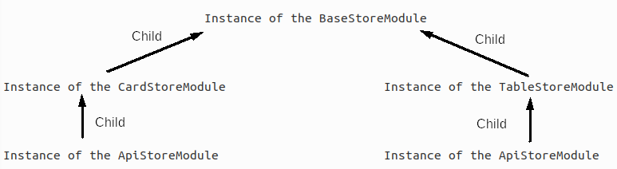

# Integration between store modules

## Prerequisites

- [Store Introduction](../../../webitel-ui/store/_Introduction/Readme.md)
- [createTableStoreModule](../../../webitel-ui/store/createTableStoreModule/Readme.md)
- [createCardStoreModule](../../../webitel-ui/store/createCardStoreModule/Readme.md)
- [createApiStoreModule](../../../webitel-ui/store/createApiStoreModule/Readme.md)
- [modules/Filters](../../../webitel-ui/modules/Filters/Readme.md)

## Опис

Стор однієї сутності зазвичай складається з кількох (стор) компонентів:

1. табличка [createTableStoreModule](../../../webitel-ui/store/createTableStoreModule/Readme.md)
2. карточка [createCardStoreModule](../../../webitel-ui/store/createCardStoreModule/Readme.md)
3. фільтри [modules/Filters](../../../webitel-ui/modules/Filters/Readme.md)
4. апішки [createApiStoreModule](../../../webitel-ui/store/createApiStoreModule/Readme.md)

По суті, всі вони потрібні для повноцінної репрезентації сутності в інтерфейсі,
але, втім, вони достатньо різні, щоб розділити їх одне від одного на окремі модулі.

Тому, хоча модулів декілька, вони як правило грають всі разом, і складаються однією купкою.

Складаються вони за ось таким форматом, в програмі-максимум:

1. У нас є базовий стор модуль, скажімо, `contacts.store.js`.
2. Він є інстансом `BaseStoreModule` [дока](../../../webitel-ui/store/createBaseStoreModule/Readme.md), та включає в
   себе,
   як чайлдів, стор таблички, і стор карточки.
3. І стор таблички, і стор карточки, містять в собі стор апішок для комунікації з бекендом.
4. А стор таблички ще має, як правило, стор фільтрів.

## Наглядно

Наглядно це виглядає ось так:



## Приклад

А ось так це робиться на прикладі:

```javascript
// contacts.store.js

import {
   createTableStoreModule,
   createCardStoreModule,
   createApiStoreModule,
   createBaseStoreModule
} from '@webitel/ui-sdk/store';
import FiltersStoreModule from '@webitel/ui-sdk/src/modules/Filters/store/FiltersStoreModule.js';

const filters = new FiltersStoreModule().addFilter([{ ... }]).getModule();

const api = createApiStoreModule({
   state: { api: { getList, get, ... } },
});

const table = createTableStoreModule({
   state: {
      headers,
   },
   getters: tableGetters,
   modules: {
      api,
      filters,
   },
});

const card = createCardStoreModule({
   state: cardState,
});

const contacts = createBaseStoreModule({
   modules: {
      table,
      card,
   },
});

export default contacts;
```
