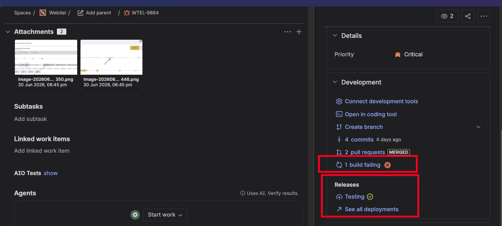
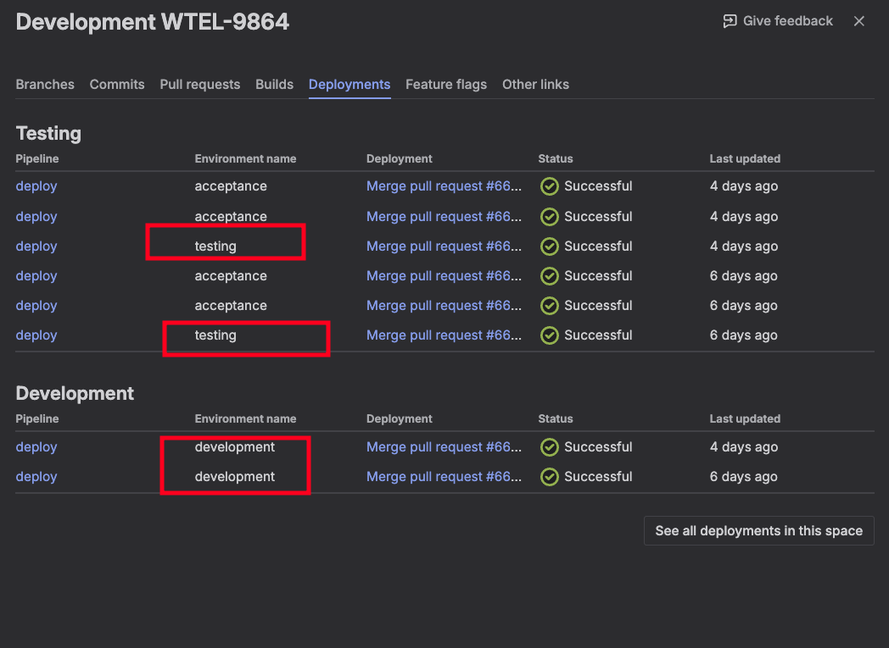
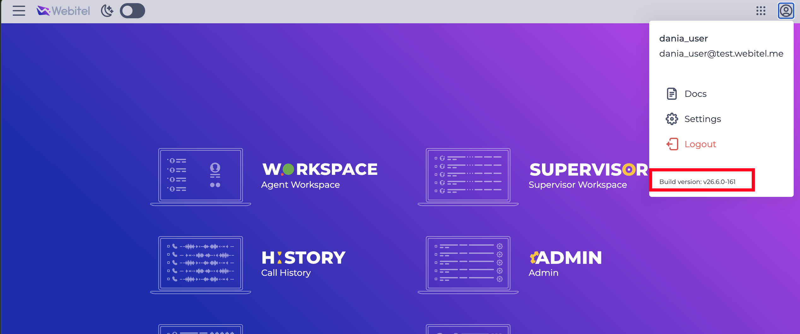
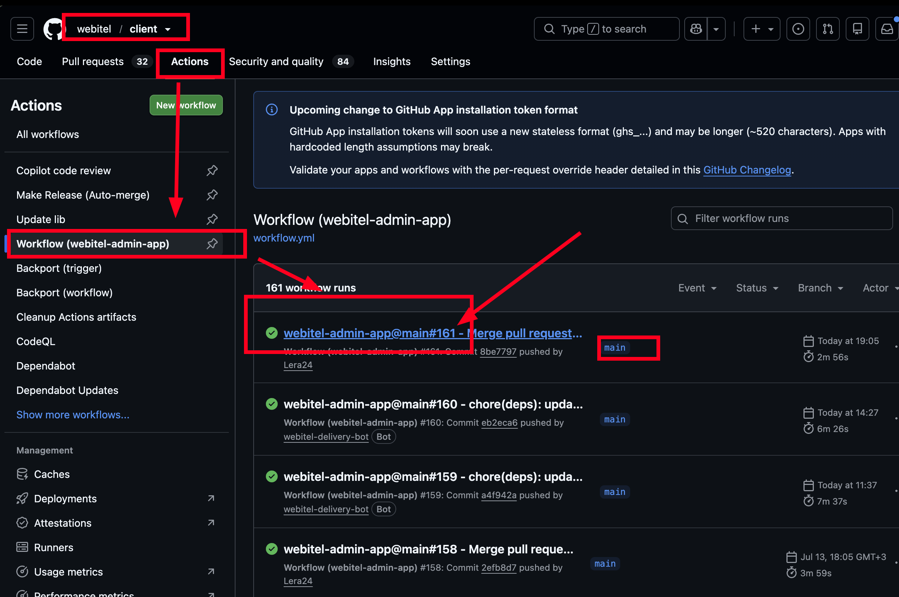
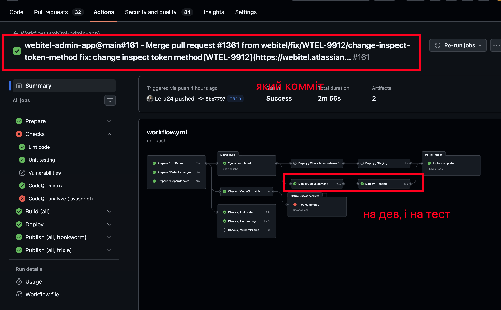
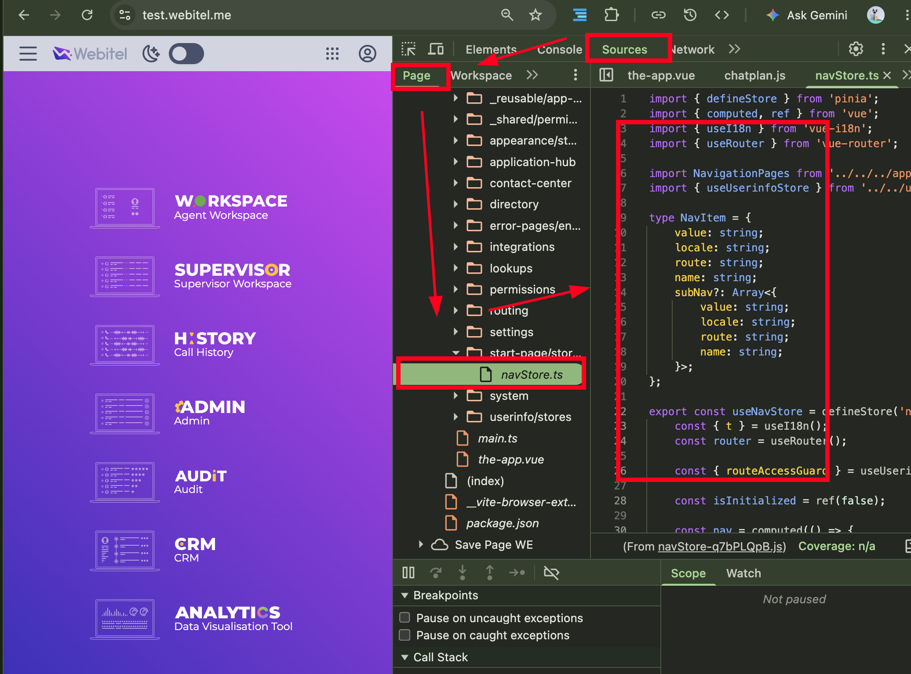

# Як перевірити, чи мої зміни задеплоїлись на test / dev env?

## Проблема

Припускаємо, що у нас є задача. Ми її виконали, зробили ПР, змерджили його, 
але проклікуємо енв і виявляється що поведінка не змінилась.

## Спосіб 1: Статус деплоймента в задачі

Дуже швидкий, але не дуже інформативний.

В Jira, в нашій задачі є секція "Development". Там ми можемо побачити інфо про білд і деплоймент.

>[!NOTE] Там, до речі, посилання. Тобто, ми можемо перейти по них і побачити на який гетхаб
> екшен ран робиться цей референс.

Але це способи неточні, тому переходимо до точніших!

## Спосіб 2: Звірити build info і перевірити статус цього білда на GitHub Actions воркфлові

В апплікейшенах, де є хедер, є також білд інфо.

Читається він як `v{version}-{build-number}`

Цікавить нас тут особливо build number.

Він робить референс на конкретний номер білда, який ми можемо побачити на Github'і.

Як можемо побачити, номер білда воркфлова співпадає з номером білда в адмінці. 
Це означає, що цей воркфлов доставив наш комміт на енв.

>[!IMPORTANT] Зважайте! Є різні воркфлови: і на ПР, і на деплой мейна. Якщо ви дивитесь на 
> воркфлов, який не в `main` і не в релізній бренчі – значить це не воно.

>[!TIP] Якщо ваш комміт в історії коммітів був раніше за той, що був доставлений останнім деплоєм – значить
> він по-любому попав.

### Який комміт?

Провалившись на цей Workflow Run, можемо побачити який комміт (у даному випадку, ПР мердж).

## Спосіб 3: Перевірити наявність діффів у файликах на енві

>[!TIP] Цей спосіб працює **тільки для test і dev енвів**. 
>
> На prod енвах ви так не подивитесь, бо там вимкнені source maps і мініфікація сорсів.

Спосіб, якщо раптом по білд інфо все сходиться, але ви підозрюєте що все одно зміни не залились.

Тоді, ви можете просто по Devtools > Sources перевірити, чи є ваші діффи там.
Через те що на тест і дев енві включені source maps і вимкнена мініфікація сорсів, ви можете
БУКВАЛЬНО зайти і подивитись чи лежать там ваші зміни. І дебаггер туди втулити, якщо захочеться.

