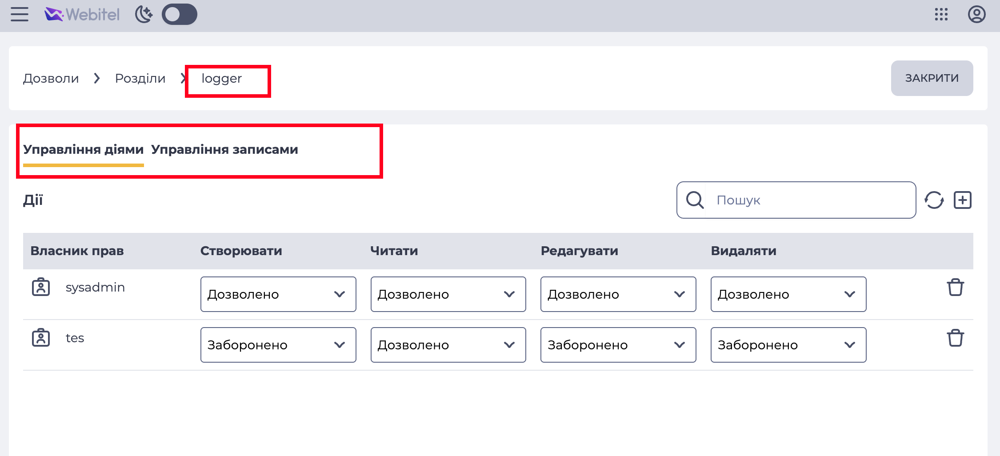
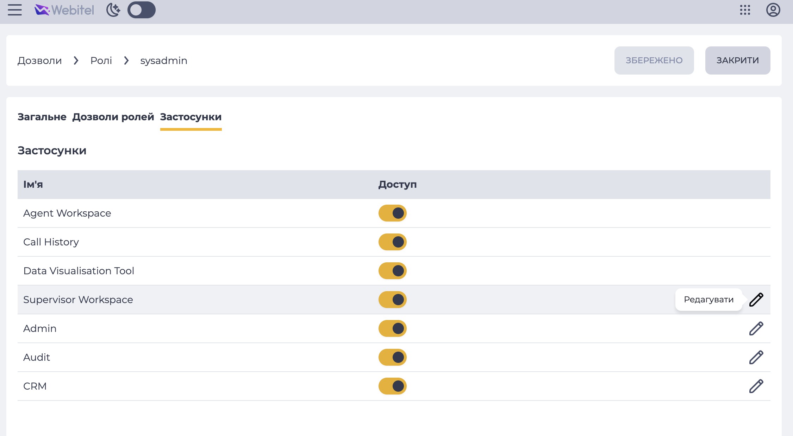

# Як назначаються Права доступу

Права доступу **сумуються** для **користувача** і **всіх його ролей**.

## Назначаються на користувача

* [Ліцензії](#ліцензії)

### Назначаються на роль

* [Global Role Permissions](#global-role-permissions)
* [Role Visual Access](#role-visual-access)
* [ObAC i RbAC](#obac--rbac) – але також можуть бути назначені і на користувача.

## Конфігурації, які впливають на наявність прав доступу

### Ліцензії

Мають найбільший вплив на функціонал: можна надати всі права користувачу та його ролі,
але без ліцензії функціонал не працюватиме.

Налаштовуються у Admin/Directory/License або у карточці користувача

*Наприклад*, 
якщо присвоїти користувачу роль, яка має глобальне право доступу на Read, а також ObAC права доступу на `cases`, але забрати у нього ліцензію `CUSTOMER_SERVICE` – то і до звернень у нього доступу не буде.

### Global Role Permissions

Складаються з CRUD прав і інших, специфічних прав на конкретні дії.

Налаштовуються в Admin/Roles у 2й табі карточки ролі.

#### Global CRUD Permissions

Фактично, "глобальне" ObAC на всі Scope Class'и на конкретну дію.

#### Global Special Permissions

Всі крім попередніх. 
Регулюють, наприклад, право на прослуховування записів розмов, 
або на перегляд екрану оператора.

### ObAC / RbAC

Регулює права доступу до конкретних Scope Class'ів. 

>[!IMPORTANT]
> Зверніть увагу! 
> 
> Один обʼєкт прав може давати доступ на декілька сутностей системи. Тобто, наприклад
> обʼєкт `dictionaries` дає право на половину розділів в `Admin/Lookups`.
> Конкретно зі списком маппінгів можна ознайомитись [тут](https://github.com/webitel/webitel-ui-sdk/blob/f16e485410173fc4ed600cbd3e5c0b0bf2cf7577/src/modules/Userinfo/mappings/mappings.ts#L24).

>[!WARNING]
> Зверніть увагу! 
> 
> **Якщо ObAC викнений, то він не працюватиме**. Тобто, "дозволено все".

### Role Applications (Visual) Access

Регулюють суто візуальний доступ до секцій на рівні навігації. 
Ідея в тому, щоб простіше і гранулярніше
давати доступ до певних роутів.

Тобто, наприклад:
1. Можна дати користувачу ObAC доступ до `users`..
2. .. але не дати візуальний доступ до самого розділу `Admin/directory/users`

Тоді користувач зможе бачити список юзерів у селектах, але при цьому не матиме змоги перейти
на сам розділ з табличкою.

Візуальний доступ ніяк не впливає на бекенд, і ніяк не регулюється. Навіть схема даних.
Це – суто фронтенд фіча.