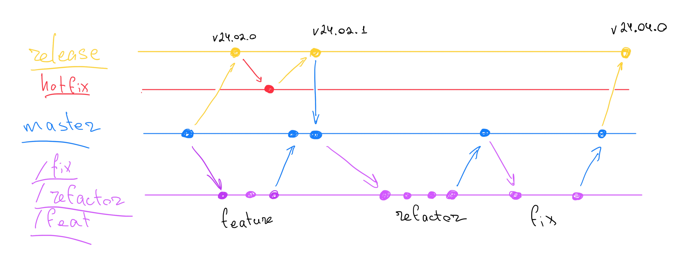

# Branching

## Спершу читаємо

1. [Git Flow](https://www.atlassian.com/git/tutorials/comparing-workflows/gitflow-workflow) methodology.
2. [Conventional Commits](https://www.conventionalcommits.org/en/v1.0.0/)

## Git Flow

Далі, по бренчах:

## Основні

- `main` / `master` - головна гілка, в яку мерджаться тільки готові фічі.
- `vYY.MM.XX` - гілки для релізів. (Наприклад, `v24.04.2`), де `24` - рік релізу,
  `04` - місяць релізу, а `2` - номер хотфікс патча.

## Додаткові

- `feat/` - гілки для фіч, наприклад, `feat/feature-name`.
- `fix/` - гілки для фіксів, наприклад, `fix/fix-name`.
- `hotfix/` - гілки для хотфіксів, які полетять і в мейн, і в реліз.
  Наприклад, `hotfix/hotfix-name`.
- `refactor/` - гілки для рефакторингів, наприклад, `refactor/refactor-name`.
- `test/` - гілки для тестів, наприклад, `test/test-name`.
- `docs/` - гілки для доків, наприклад, `docs/page-name`.

## `/WTEL/` префікси для бренчів

Для зручності відстеження задач у Jira,
до назви гілки додається ідентифікатор задачі у форматі `WTEL-XXXX` після префіксу типу (`feat/`, `fix/` тощо).
Це дозволяє легко ідентифікувати звʼязок між гілкою та відповідною задачею.

Приклади: 

- `feat/`     -> `feat/WTEL-7623/add-new-table-section`

- `fix/`      -> `fix/WTEL-7610/fix-overlapping-modal`

- `hotfix/`   -> `hotfix/WTEL-7655/fix-crash-on-save`

- `refactor/` -> `refactor/WTEL-7630/optimize-table-component`

- `test/`     -> `test/WTEL-7641/add-integration-tests`

