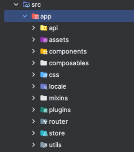
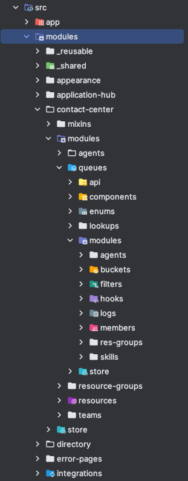

# Frontend Applications, Structure

Front-end частина Webitel складається з декількох окремих standalone апплікейшенів,
які (за потреби, що буває доволі рідко) взаємодіють через `redirects`, та `localStorage`.

_Запитаєте: Чому? - Скажу: історично_ 🙂

[Список](../applications-list/Readme.md) апплікашок.

## Взаємозвʼязок та взаємодія

Як такого, **звʼязку чи взаємодії між різними апплікаціями немає**.

Весь спільний, реюзабельний код виноситься у окремі пакети [`@webitel/..`](https://github.com/webitel/webitel-ui-sdk). Перехід між апплікейшенами
відбувається через спільну навігацію, а інформація про користувача завантажується у кожному апплікейшені
окремо.

Втім, авторизація має бути спільною, а також необхідно забезпечити перехід від адмінки до флова, і назад.
Це реалізовано через `route` `redirect` `query params`.

## Структура в середині апплікейшенів

Є певний паттерн та логіка, згідно якої розміщаються файлики та папочки у проектах. Основна
ідея в тому, що проекти "нарізаються" на [feature slices](https://feature-sliced.design/).

_Note: Я вперше загуглив це і вперше зайшов на цей сайт, тож, якщо що,
не обіцяю що у нас все структуровано, як в reference model_ 🙂

Як правило, на руті є папки `/app` i `/modules`.

### Папка `/app`

_(на прикладі [адмінки](https://github.com/webitel/client))_

У папці `app` лежить:

* сетап апплікейшена,
* рут компонентик,
* підключення глобальних плагінів, 
* роутер, 
* основний стор модуль, 
* якісь повністю shared скрипти, компоненти, etc.

Як правило, при роботі з проектом, туди додавати нічого не треба, бо там вже все було додано на етапі
сетапу цього проекту 🙂.

### Папка `/modules`

_(на прикладі [адмінки](https://github.com/webitel/client))_

У папці `/modules` лежать модулі-фічі. Залежно від апплікейшена, ділення на фічі можуть відбуватися по-різному.

Наприклад, у адмінці це можуть бути одночасно ділення по роутах, і просто модуль зі стором, спільним
для всіх попередніх роутів.

Кожен модуль може містити в собі такі штуки (і відповідно папки), як:

- `/api`
- `/components`
- `/css`
- `/store`
- `/assets`
- `/enums`
- `/scripts`
- `/mixins` та (або) `/composables`
- `/modules`

Ну і щось більш екзотичне, залежно від потреби.

#### Рекурсивність модулів

Модуль може включати в себе модулі. Рекурсивно, на будь-яку глибину.

_Note: store має бути ієрархічним, тобто, модуль-чайлд має бути так само чайлдом стор-модуля._

## `@webitel/..` npm packages

Власні ліби, з shared кодом, які паблішаться у npm.

Доки – тут же, поруч.

Станом на `v25.06`:

### `@webitel/api-services`

Взаємодія з беком.

### `@webitel/ui-datalist`

Побудова табличок, карточок, фільтрів, валідацій.

### `@webitel/ui-sdk`

Загальна ліба. Наразі там все на купу накидано.