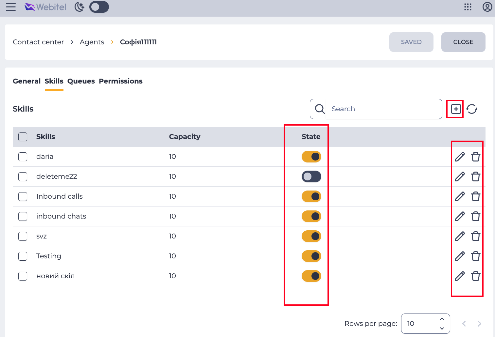

# Access Control Cookbook

[[toc]]

## Обмежити доступ до розділу

[Route Access Guard](../Readme.md#перевірка-на-етапі-роутингу) має це зробити, якщо на роут правильно вказані
метадані.


```ts
// router.ts

import { WtApplication, CrmSections, WtObject } from '@webitel/ui-sdk/enums'; // [!code ++]

const routes = [
    {
        path: '/',
		name: 'crm-workspace',
        meta: {
            WtApplication: WtApplication.Crm, // [!code ++]
        },
        children: [
            // ...
            {
                path: 'contacts',
                meta: {
                    UiSection: CrmSections.Contacts, // [!code ++]
                    WtObject: WtObject.Contact, // [!code ++]
                },
            },
        ],
    },
];
```

>[!IMPORTANT]
> Якщо не робе, а все налаштовано правильно, то перевірте чи [ініціалізований](../Readme.md#ініціалізація) роут гард в `main.ts`

## В середині компонента-карточки перевірити права для сутності, вказаної в роутинг метадаті

Про router meta приклад вище.

```ts

// opened-user-general.vue

import { useUserAccessControl } from './.. ../app/composables/useUserAccessControl';

const {
    disableUserInput,
    hasCreateAccess,
    hasDeleteAccess,
    hasUpdateAccess,
} = useUserAccessControl(/* ! */); // якщо немає параметра, то роздупляється по route meta [!code highlight]
```

## Перевірка прав до певного Обʼєкта

Типовий кейс: заборонити редагувати конкретне поле-селект в карточці, якщо немає прав на Обʼєкт, який в тому селекті обирається.

Наприклад: User має поле Contact, але якщо немає прав на читання Contact,
то і поле показувати немає сенсу – буде помилка.

```ts
// opened-user-general.vue

import { WtObject } from '@webitel/ui-sdk/enums';

import { useUserAccessControl } from './.. ../app/composables/useUserAccessControl';


const { hasReadAccess: hasContactsReadAccess } = useUserAccessControl(
    WtObject.Contact,
);
```

## Перевірка Прав на конкретний роут за межами роутера

Наприклад, нам треба порахувати в компоненті чи сторі доступну для користувача навігацію. 

А отже треба певні роути перевірити на access guard,
але не як `beforeEnter` роутер хук, а всі ті роути "прогнати" через гард, щоб задізейблити недоступні.

```js
// crm -> navStore.ts

const router = useRouter();

const { routeAccessGuard } = useUserinfoStore();

const nav = computed(() => {
    const contactsRoutePath = '/contacts';
    const contactsRoute = router.resolve({
        path: contactsRoutePath,
    });
    const hasContactsAccess = routeAccessGuard(contactsRoute) === true;
    // ...
});
```

## Перевірка на Специфічні Права Ролі

Наприклад, треба перевірити чи (цей) користувач може
переглядати екран операторів у супервізорі (за це відповідає окреме право у `Admin/Permissions/Roles` -> `Permissions` tab)

```js
import { SpecialGlobalAction } from '@webitel/ui-sdk/modules/Userinfo';

import { useUserinfoStore } from '../.. ../userinfoStore'; // this app userinfoStore

const userinfoStore = useUserinfoStore();

const isControlAgentScreenAllow = computed(() =>
	userinfoStore.hasSpecialGlobalActionAccess(
		SpecialGlobalAction.ControlAgentScreen,
	),
);
```

## Перевірка Прав на вкладену сутність в карточці через Update

>[!TIP]
> Читайте вдумливо, кейс специфічний і важливий!

Це специфічна перевірка прав для табличок які є табами в карточках,
утворюючи звʼязок one-to-many між цими сутностями.

Або просто child-сутності, `Create`/`Read`/`Delete` робота з якими все одно керується
тільки правом `Update` перента.

Наприклад:

* Admin / Contact Center / Agents -> Skills tab

В карточці Агента, в табі його (!) Скілів у нас є дії **Додавання**, **Редагування** і **Видалення**.

**Але фактично вони регулюються одним правом: правом на Update цього Агента**, в карточці якого ми 
знаходимось.

Тому що, фактично, ми апдейтимо Запис Агента, Додаючи/Оновлюючи/Забираючи його Навичку.



```js
// Admin -> opened-agent-skills.vue

const { disableUserInput } = useUserAccessControl({
	useUpdateAccessAsAllMutableChecksSource: true, // [!code highlight]
});
```

Ще приклади, де таке зустрічається:

* CRM / Cases -> Case links
* CRM / SLA -> SLA Conditions
* Admin / Queues -> Skills
* Admin / Queues -> Members

## `useUserAccessStore()` з Global Role Permissions

Коли ми працюємо із якимось специфічним обʼєктом, який не має свого власного ObAC,
і має керуватися глобальними правами ролі.

Наприклад:

* Users -> Tokens
* Permissions tab в карточках сутностей
* License

```js
// Admin -> hasUserTokensAccess.ts

const {
    hasReadAccess: hasGlobalReadAccess,
    disableUserInput: disableUserInputGlobalAccess,
    hasDeleteAccess: hasGlobalDeleteAccess,
    hasCreateAccess: hasGlobalCreateAccess,
    hasUpdateAccess: hasGlobalUpdateAccess,
} = useUserAccessControl({
    useGlobalAccessAsChecksSource: true, // [!code highlight]
});
```

## Перевірка наявності конкретної ліцензії

Наразі це специфічні кейси для Workspace, де треба перевірити чи є у користувача конкретна
ліцензія для роботи з певним функціоналом. 

Наприклад, для роботи агента з контактами:

```js
// Workspace -> call-contacts-container.vue

import {
	WebitelLicense,
} from '@webitel/ui-sdk/modules/Userinfo';


const { hasLicense } = useUserinfoStore();


const hasCallCenterLicense = computed(() =>
	hasLicense(WebitelLicense.CallCenter),
);
```
