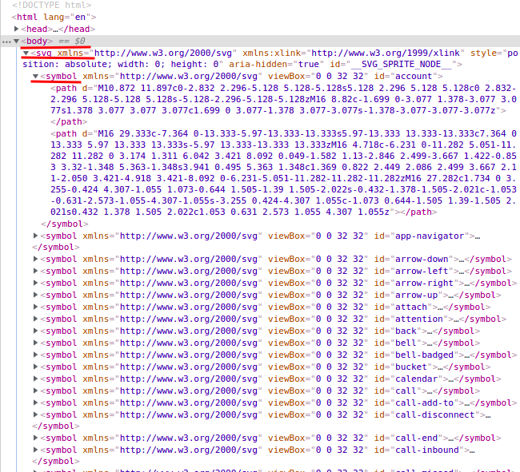
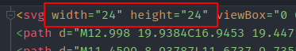
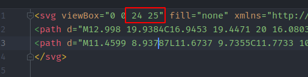
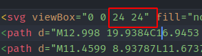
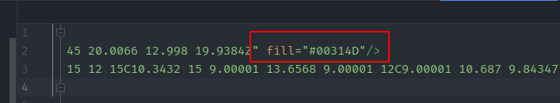

# WtIcon

## Props

::: raw
<Docs />
:::

<wt-icon icon="edit"></wt-icon>

### Different colors:

<wt-icon
  icon="edit"
  size="lg"
  :color="color"
></wt-icon>
{{ color }}

## How does it work?

Icons are located in <code>assets/icons/sprite</code> directory, in <code>SVG</code> format,
without <code>width</code> and <code>height</code> attributes, but with <code>
[viewBox](https://developer.mozilla.org/ru/docs/Web/SVG/Attribute/viewBox)
</code> attribute.
(<code>viewBox</code> is provided by designer in svg pic itself - so you just need to check it presence,
by the way check for `width` `height` absence).

For example:

At build stage, <code><a href="https://github.com/JetBrains/svg-sprite-loader#svg-sprite-loader">svg-sprite-loader</a></code>
collects all icons (looking for "All files`.svg` in all directories, which names include `sprite`,
). This rule is described in <code>vue.config.js:</code>
(from "Quick Start" icons installation section):

<pre class="language-javascript"><code>
config.module
    .rule('svg')
    .exclude.add(/^(.*sprite).*\.svg/); // same as in svg-sprite-loader

config.module
    .rule('svg-sprite')
    .test(/^(.*sprite).*\.svg/) // same as in svg-url-loader
    .use('svg-sprite-loader')
    .loader('svg-sprite-loader');
</code></pre>

So that, all these icons are collected in one sprite. This sprite is injected in <code>index.html</code>.

For example: (By the way, you can check it if you want to see, which icons were collected in this sprite):

Then, these icons can be used as:

<pre class="language-html"><code>
&lt;svg&gt;&lt;use xlink:href="#attach"&gt;&lt;/use&gt;&lt;/svg&gt;
// or, using wt-icon component:
&lt;wt-icon icon="attach"&gt;&lt;/wt-icon&gt;
</code></pre>

## How to install your custom icons to project?

`svg-sprite-loader` webpack rule in <code>vue.config.js</code> also collects all icons from `sprite`
directories in project and adds it to final sprite.

*In fact, webitel-ui icons are added to sprite just cause they're imported from
"sprite" directory - just in <code>node_modules</code>*

For stylistic purposes, it's recommended to allocate icons in <code>src/(app?)/assets/icons/sprite/*</code>,
So that developers and designer could find (and then check or update) them in any project.

All icons from this directory should be imported in <code>index.js</code> in this directory
(create `index.js` if it doesn't exist).

Then, `index.html` should be imported in `main.js`:
<pre class="language-javascript"><code>import './assets/icons/sprite';</code></pre>

And, then, if you put some new icons in this directory, and import them in `index.js`,
they automatically become available in project.

### Simple TODO:
* Create directory `src/(app?)/assets/icons/sprite/` (if doesn't exists)
* in this folder, create `index.js` (if doesn't exists)
* Import `index.js` to `>main.js` (if doesn't exists)
* Put icon to this directory, and import it to `index.js`
* That's all, you're awesome!

## Icon sprites naming convention:

App-specific icons are highly recommended to be named with the prefix corresponding to this application.

The reason is: when you see an icon usage, you will be able to distinguish `svg` location:
in this app, or library - and update it, if needed.
*For example, if you want to move this icon from app to library, you just need to remove `icon-prefix` prop
from all icon usages (and, of course, rename the icon file)*

### Icon prefix corresponding to application:
* **Webitel UI:** no prefix
* **Admin:** `adm-`
* **Workspace:** `ws-`
* **Supervisor:** `sv-`
* **History:** `hs-`
* **Webitel CC UI:** `cc-`

## How to clean up icons before adding them to project?

After export from Figma, icons should be cleaned up to avoid a few issues.

Use this checklist:
1. **Remove** `width` and `height` from svg-tag

2. **Check** `viewBox`: it's size should be square **(BUT DO NOT DELETE!)**

If there's an issue, contact the designer.

Incorrect:

Correct:

4. **Remove** `fill="none"` from svg-tag

5. **Remove** all `fill=""` with default color

*Default "fill" should be cleaned up, cause Figma adds it to icon by default, but we are
changing this fill in styles to suit our needs.
But! Specific colors should stay in svg-code. (for instance, red dot in `record` icon)*

## Available icons

  

    

      <wt-icon
        :icon="icon"
        size="xl"
      ></wt-icon>
      {{ icon }}
    

  

