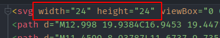
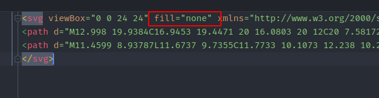

### [How to clean up icons before adding them to project?](#cleanup-icons)

After export from Figma, icons should be cleaned up to avoid a few issues.

Use this checklist:
1. **Remove** `width` and `height` from svg-tag
   

2. **Check** `viewBox`: it's size should be square **(НО НЕ УДАЛЯТЬ!)**

If there's an issue, contact the designer.

Incorrect:

Correct:

4. **Remove** `fill="none"` from svg-tag
   

5. **Remove** all `fill=""` with default color

*Default "fill" should be cleaned up, cause Figma adds it to icon by default, but we are
changing this fill in styles to suit our needs.
But! Specific colors should stay in svg-code. (for instance, red dot in `record` icon)*

