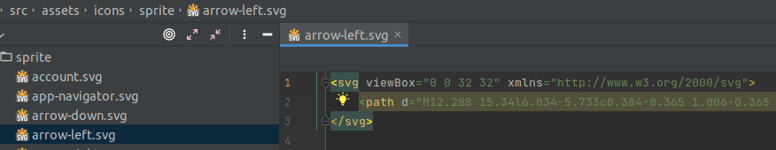

### [How does it work?](#how-does-it-work)

Icons are located in <code>assets/icons/sprite</code> directory, in <code>SVG</code> format,
without <code>width</code> and <code>height</code> attributes, but with <code>
[viewBox](https://developer.mozilla.org/ru/docs/Web/SVG/Attribute/viewBox)
</code> attribute.
(<code>viewBox</code> is provided by designer in svg pic itself - so you just need to check it presence,
by the way check for `width` `height` absence).

For example:

At build stage, <code><a href="https://github.com/JetBrains/svg-sprite-loader#svg-sprite-loader">svg-sprite-loader</a></code>
collects all icons (looking for "All files`.svg` in all directories, which names include `sprite`,
). This rule is described in <code>vue.config.js:</code>
(from "Quick Start" icons installation section):

<pre class="language-javascript"><code>
config.module
    .rule('svg')
    .exclude.add(/^(.*sprite).*\.svg/); // same as in svg-sprite-loader

config.module
    .rule('svg-sprite')
    .test(/^(.*sprite).*\.svg/) // same as in svg-url-loader
    .use('svg-sprite-loader')
    .loader('svg-sprite-loader');
</code></pre>

So that, all these icons are collected in one sprite. This sprite is injected in <code>index.html</code>.

For example: (By the way, you can check it if you want to see, which icons were collected in this sprite):

Then, these icons can be used as:

<pre class="language-html"><code>
&lt;svg&gt;&lt;use xlink:href="#attach"&gt;&lt;/use&gt;&lt;/svg&gt;
// or, using wt-icon component:
&lt;wt-icon icon="attach"&gt;&lt;/wt-icon&gt;
</code></pre>

