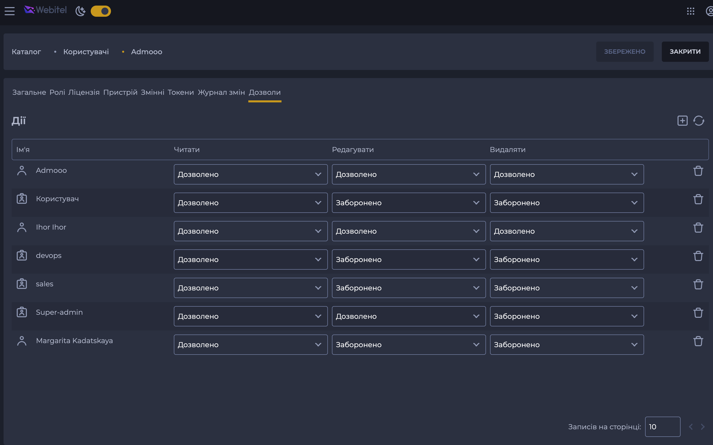

# ObjectPermissions Module

Модуль таби пермішенів в карточці сутності.

## Шо то таке

Виглядає десь так:



Складається з двох частин:

- компонент таби (`components/permissions-tab.vue`)
- стор таби (`store/index.js`)

## Як використовувати

Щоб використати цей модуль, потрібно виконати наступні кроки:

1. Додати компонент таби в роутинг
2. Додати стор таби в модулі карточки сутності, якої стосуються ці пермішени
3. На компонент (який мав би передатися з роутингу) додати необхідні пропси.
4. Додати в апі модуля generatePermissionsApi (див.нижче)

## Звідки береться апі?

Генерується в межах апі для карточки, тому що пермішени належать до неї,
і будуються за однаковим принципом через дописування `/acl` до URL запиту.

Детально в [generatePermissionsApi.js](../../api/clients/_shared/generatePermissionsApi.js).

## Як додати компонент таби в роутинг?

Щось на кшталт:

```js
// user module routing

const PermissionsTab = () =>
  import(
    '@webitel/ui-sdk/src/modules/ObjectPermissions/components/permissions-tab.vue'
  );

const UsersRoutes = [
  // ...
  {
    path: '/directory/users/:id',
    name: `${RouteNames.USERS}-card`,
    component: OpenedUser,
    // ...
    children: [
      // ...
      {
        path: 'permissions/:permissionId?', // роутинг завішаний саме на ``permissionsId` параметрі.
        name: UsersRouteNames.PERMISSIONS,
        component: PermissionsTab,
      },
    ],
  },
];
```

## Детальніше

[`components/permissions-tab.vue`](./components/permissions-tab.vue)

[`store/index.js`](./store/index.js)
