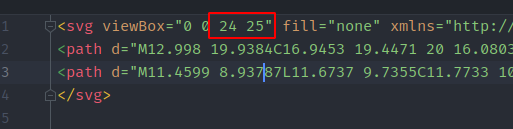
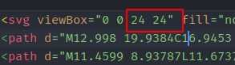
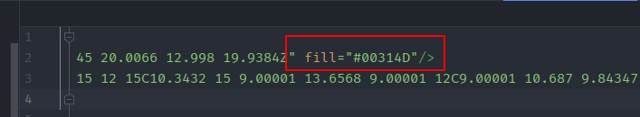

### [Как подчистить иконки перед добавлением в проект?](#cleanup-icons)

После экспорта из Figma, иконки нужно подчищать, чтобы при их использовании не было проблем.

Надо проверить такие пункты:
1. **Удалить** ширину и высоту из svg-тега

2. **Проверить** `viewBox`: обязательно, чтобы его размер был квадратным **(НО НЕ УДАЛЯТЬ!)**

Если что-то не так, обратитесь к дизайнеру.

Некорректно:

Корректно:

4. **Удалить** `fill="none"` из svg-тега

5. **Удалить** все `fill=""` со стандартным цветом

*Подробно: филл нужно удалять, потому что мы хотим его перезатирать в стилях, когда меняем
цвет иконки. Но! Цвет, который всегда должен быть таким - не удаляем (например, красную точечку 
у иконки `record`)* 

