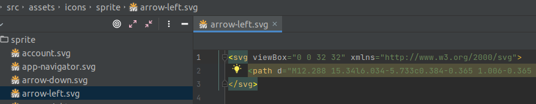

### [How does it work?](#how-does-it-work)

Иконки пакуются в специальную папку <code>assets/icons/sprite</code>, в <code>SVG</code> формате,
без указания параметров <code>width</code> <code>height</code>, но с указанием <code>
[viewBox](https://developer.mozilla.org/ru/docs/Web/SVG/Attribute/viewBox)
</code>
(<code>viewBox</code> указывается дизайнером при создании картинки - нужно просто следить, есть ли он,
и нет ли ширины-высоты). Например:

Далее, <code><a href="https://github.com/JetBrains/svg-sprite-loader#svg-sprite-loader">svg-sprite-loader</a></code>
собирает их (по правилу "Все файлы из всех папок, в названии которых есть "sprite",
и эти файлы имеют расширение <code>.svg</code>) согласно этому правилу в <code>vue.config.js:</code>
(взято из инструкции по установке иконок):

<pre class="language-javascript"><code>
config.module
    .rule('svg')
    .exclude.add(/^(.*sprite).*\.svg/); // same as in svg-sprite-loader

config.module
    .rule('svg-sprite')
    .test(/^(.*sprite).*\.svg/) // same as in svg-url-loader
    .use('svg-sprite-loader')
    .loader('svg-sprite-loader');
</code></pre>

После этого все иконки пакуются в спрайт, который затем вставляется в <code>index.html</code>
и переиспользуется.
Выглядит это примерно так (Кстати, таким же образом можно проверить, какие иконки и в каком виде
вошли в спрайт):

Далее эти иконки можно использовать как:

<pre class="language-html"><code>
&lt;svg&gt;&lt;use xlink:href="#attach"&gt;&lt;/use&gt;&lt;/svg&gt;
// or, using wt-icon component:
&lt;wt-icon icon="attach"&gt;&lt;/wt-icon&gt;
</code></pre>

